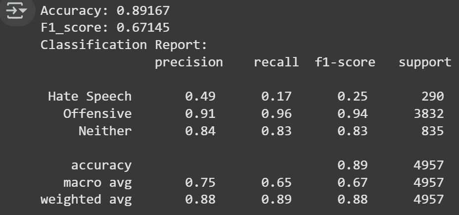
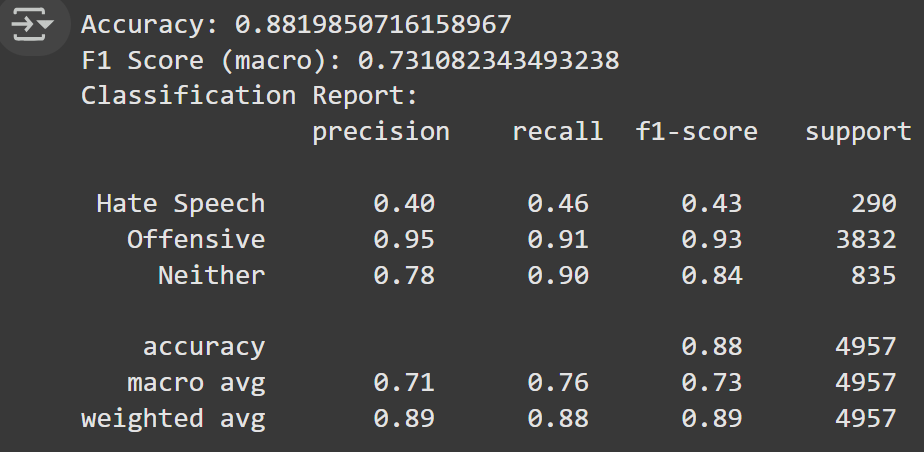

# Hate-Speech-and-Offensive-Language-Text-Classification
This is a text classification for Hate Speech and Offensive Language Dataset, the model used in the classification task is LogisticRegression and TfidfVectorizer.

There are two files in the repository which is main.v1 and main.v2, in which v1 only implements basic function and v2 trains the model with GridSearchCV which allows us to explore various combination of hyperparameter.

We can see the F1_score increases roughly about **7%** from the **67%** of main.v1 to the **73%** of main.v2

# Screeshot
the screenshot of result regarding main.v1:

the screenshot of result regarding main.v2:

# Dataset Link
https://www.kaggle.com/datasets/mrmorj/hate-speech-and-offensive-language-dataset

# References
https://scikit-learn.org/stable/modules/generated/sklearn.linear_model.LogisticRegression.html

https://scikit-learn.org/stable/modules/generated/sklearn.model_selection.GridSearchCV.html